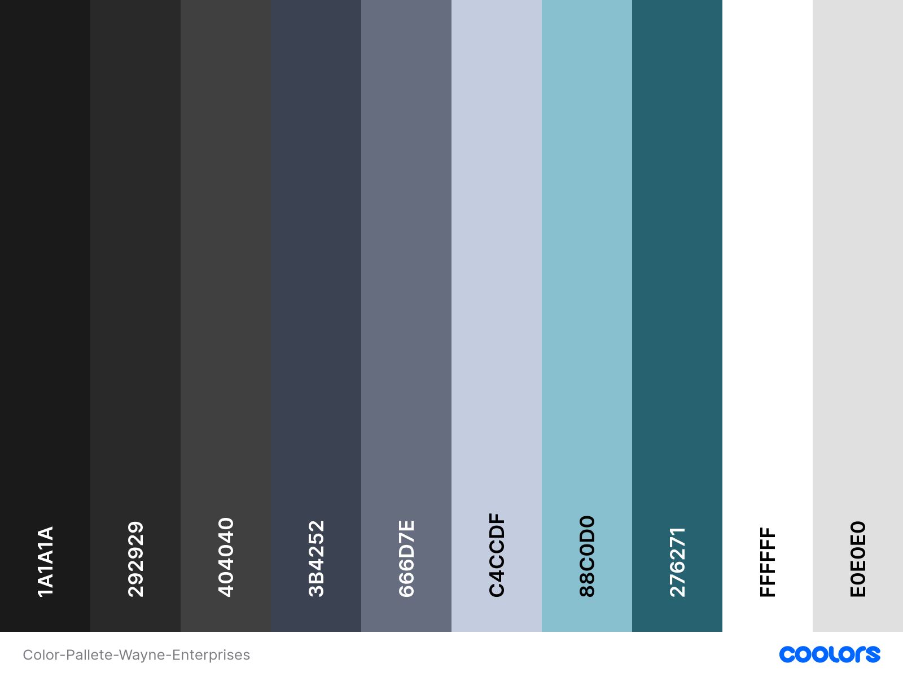
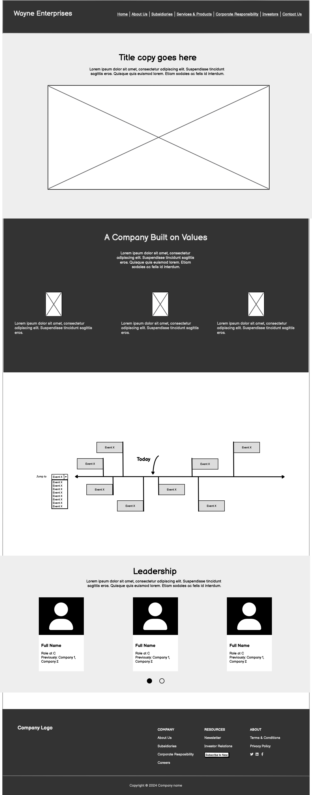

# Wayne Enterprises

A fan-made website for the fictional conglomerate Wayne Enterprises

"Wayne Enterprises (formerly WayneCorp) is a company in the DC Universe. Wayne Enterprises is owned by billionaire Bruce Wayne and run by his business manager Lucius Fox. It was founded by merchant ancestors of the Wayne family in the 17th century as a merchant house. It changed and gradually grew when it was officially erected in the 19th century when Alan Wayne, heir to Solomon Wayne, founded Wayne Shipping and Wayne Chemical. Along with Wayne Manufacturing, which came later, the Industrial Revolution fueled Wayne Enterprises into becoming a major powerhouse."

[Batman Wiki](https://batman.fandom.com/wiki/Wayne_Enterprises)

View Site -> [Wayne Enterprises](https://mattds825.github.io/Wayne-Enterprises/)

## Contents

- [User Experience](#user-experience-ux)
    * [Project Goals](#project-goals)
        - [User Goals](#user-goals)
        - [Business Goals](#business-goals)
    * [User Stories](#user-stories)
        - [General Info](#general-info)
        - [Potential Investors](#potential-investors)
        - [Potential Empolyees](#potential-employee)
- [Design](#design)
    * [Color Pallete](#color-pallete)
    * [Typography](#typography)
    * [Imagery](#imagery)
    * [Wireframes](#wireframes)
- [Features](#features)
    * [All Pages](#all-pages)
    * [Home Page](#home-page)
    * [About Us Page](#about-us-page)
    * [Corporate Responsibility Page](#corporate-resposibility-page)
    * [Subsidiaries Page](#subsidiaries-page)
    * [Investor Relations Page](#investor-relations-page)
    * [Careers Page](#careers-page)
    * [Contact Us Page](#contact-us-page)
    * [Under Construction Page](#under-construction-page)
- [Accesibility](#accesibility)
- [Feedback](#feedback)
- [Credits](#credits)
    * [Media](#media)
    * [Code and Resources Used](#code-and-resources-used)
    * [Technology and Tools Used](#techonologies-and-tools-used)
- [Deployment](#deployment)

- - -

## User Experience (UX)

### Project Goals

#### User Goals

For this project the main users frequenting the site can be split into two main categories: Investors/Potential Investors and general members of the public seeking information and/or contact. A third smaller group that can be target is potential employees.

For the First group of people they are will be either seeking general information:

- History
- Services and Technologies
- Subsidiaries
- Company leadership

or contact information:

- address and contact information
- contact form
- FAQ

They will possibly only use the site once until a new reason to visit shows up.

For the second group, they are primarily looking for:

- financial information
- subsidiaries
- technologies and products
- newsletters and company updates

 They will probably use the website at least once per month.

 For the third group, these are people who might have initially been in the first two groups but are also open to the idea of looking for a new career. They can also be people who are intentionally searching through nearby company vacancies, or even still be linked from an external job aggregate site. The important information for this group would be:

- Job Openings
- Company work culture
- Benefits
- Apprenticeship cohort dates

They could visit the site multiple times while checking for job updates

#### Business Goals

The business goals are to have a front facing part of the company that the public can interact with and reflects the companies image and principles. Their goals are also to make sure their website also offers the most use and value for the 3 groups of users outlines previously; they want to make investors happy and keep them informed, make contact and information about the company accessible to the public and attract possible talent.

### User Stories

For this section I will show three possible user interactions based on the purpose for which the user is accessing the site, which I will separate into: **General Info**, **Potential Investor** and **Potential Employee**.

#### General Info

Situation: Someone is interested in buying a piece of technology from one of the companies subsidiaries, however they want to make a conscious purchase and would like to access information about the parent company that may help them see if purchasing from this company would align with their ethical values.

**Story:**

1. User visits the Wayne Enterprises Home page after searching it on a web browser
2. The user navigates to the “About Us” page because from experience they know that is where they can expect to find information about the company’s history and values
3. The user then navigates to the Corporate Responsibility Page to read about the company’s ethical practices
4. Satisfied with the information so far the user then Heads to the Subsidiaries Page to see what other products the company endorses
5. They then click on the “Wayne Technologies” Subsidiary which is the company that manufactures the product they are interested in 
6. The user can then review the product in detail and see if it align with their ethical value and be linked to a option to purchase it from a retailer

 

**Acceptance Criteria:**

- Home Page
    - Should have a inviting look
    - Should have prominent link to the About Us section in a familiar position (Navigation bar at top of page)
- About Us Page
    - Should have detailed transparent history of the company
    - Should showcase the company’s leadership and values
    - There is an easily accessible section that links the company's ethical commitments and community initiatives (goes to corporate responsibility page)
- Corporate Responsibility Page
    - Should be Easily Accessible from Navigation Bar in each page
    - The page should highlight the company’s efforts in philanthropy, environmental sustainability, and community projects.
    - The user can find specific examples of initiatives and partnerships that demonstrate the company’s commitment to ethical practices.
- Subsidiaries Page
    - The user can easily navigate to information of each subsidiary
    - There is a clear link between the subsidiary’s projects and the parent company’s ethical guidelines.
- Footer and Navigation Bar
    - This should both have clear links to the About Us and Corporate Responsibility Pages, ensuring easy and intuitive navigation

#### Potential Investors 

Situation: An investor in looking to expand their portfolio and has heard some word for mouth and read some news about Wayne Enterprises. He wants to get as much information about the company as he can to make an informed decision.

Story:

1. The user visits the Wayne Enterprises Home Page where they can read some oof the most recent updates to the newsletter
2. The user navigates to the "About Us" page to get an overview of the company’s history, leadership, and values.
3. The user proceeds to the "Investor Relations" page to review financial reports, stock information, and possibly download recent and past press releases.
4. The user subscribes to the newsletter for regular updates on company activities and financial performance.
5. The user explores the "Subsidiaries" page to understand how different parts of the company contribute to its overall success.
6. The user checks the "Corporate Responsibility" page to assess the company’s ethical and sustainability practices.
7. The user can then decide to invest or interact with the company through newsletter updates until they decide if they want to invest

Acceptance Criteria

- Home Page
    - The user can find quick links to "Investor Relations," "About Us," and "Newsletter Signup" sections. They can also read some of the last newsletter headlines and stories snippets
- About Us Page
    - The page provides a thorough history of Wayne Enterprises, highlighting major milestones, leadership, and corporate values.
- Investor Relations Page
    - The page offers access to financial reports , and stock performance.
    - There are press releases providing insights into the company's recent activities and future prospects.
    - The user can subscribe to newsletters for regular updates.
- Subsidiaries Page
    - The user can explore detailed information about each subsidiary’s contributions to the overall business.
- Corporate Responsibility Page
    - The page highlights the company’s ethical practices, sustainability efforts, and community involvement, showing a commitment to social responsibility.
- Footer, Header
    - Each page contains a footer with links to the "Investor Relations," "About Us," and "Newsletter Signup" sections, ensuring easy navigation.

#### Potential Employee

Situation: Someone has been job searching and they are linked to the Vacancies section of the website. They want to gain information about the company, explore the open vacancies, company culture and history and decide if they would like to work at this company and apply 

User Story:

1. The user is directed to the "Vacancies" page of the Wayne Enterprises website.
2. The user explores the list of job openings  to see current positions available
3. The user see the Employee Benefits section
4. The user navigates to the "About Us" page to learn about the company’s history, leadership, and values.
5. Satisfied with the information, the user decides to apply for a position at Wayne Enterprises.

Acceptance Criteria

- Vacancies Page
    - The user can view a list of current job openings with descriptions and application links.
    - The is clear information about the Employee Benefits and Company Culture
- About Us Page
    - The page provides a thorough history of Wayne Enterprises, highlighting major milestones, leadership, and corporate values.
- Header, Footer
    - Each page contains a footer with links to the "Investor Relations," "About Us," and "Newsletter Signup" sections, ensuring easy navigation.

---

## Design

### Color Pallete

For this project the color pallette should be dark and modern. It should evoke professionalism and business. There should be plenty of contrast and readability. The pallette should also be appropriately represent the dark aesthitic of the DC Universe Gotham in which the company has its history. 

The bakcground colors I chose
- #1a1a1a;
- #292929;
- #404040;

The primary colors I have uses in the site are
- #3b4252;
- #666d7e;
- #c4ccdf;

The accent colors I ahve uses are
- #88c0d0;
- #276271;

The text colors I have used are
- #FFFFFF;
- #e0e0e0;

### Typography 

I used Google Fonts to import the fonts for the site

The Primary font I chose was **Playfair Display**

- Usage: Headings, navigation menus, and call-to-action buttons.
- Reason: Playfair Display is a serif font that combines elegance and modernity, giving a distinguished look to the headings.

The Secondary font I chose was **Lato**

- Usage: Body text, detailed descriptions, and secondary content.
- Reason: Lato is a sleek, sans-serif font that pairs well with Playfair Display, offering readability and a contemporary feel.

### Imagery

As the website is a public facing entity a large corporation, the imagery has to refelt that, showing large scale projects and cities and to impart a sense of scale. The images also need to be of professional qiuality and cannot distract from the accesibililty of the page

### Wireframes

The wireframes for this project were created using Balsamiq and made for desktop, tablet and mobile.

### Home Page Wireframes

| Desktop | Tablet | Mobile|
|:-:|:-:|:-:|
||||

### About Us Wireframes

| Desktop | Tablet | Mobile|
|:-:|:-:|:-:|
||||

### Corporate Resposibility Wireframes

| Desktop | Tablet | Mobile|
|:-:|:-:|:-:|
||||

### Subsidiaries Wireframes

| Desktop | Tablet | Mobile|
|:-:|:-:|:-:|
||||

## Features

The Website will have the follwing pages: Home, About Us, Subsidiaries, Services & Products, Coorporate Resposibility, Investor Relations, Careers, Contact Us. 

The MVP for the website will be the Home, About Us, Subsidiaries,  Coorporate Resposibility, Careers and Contact Us pages

There will also be a work in progress template page that will be added to all the pages that do not meet the MVP 

### All Pages

All these pages will be responsive as shown in the wireframe. They will also all share the following elements:

- **Navbar**
    - At the top of every page the user will find a navigation bar with the company logo on the left side and a link to each of the individual pages of the site on the top right. For mobiles this will be condensed in to the conventional 'Hamburger Icon' for ease of use.
    
    

- **Footer**
    - At the bottom of each page will be a footer that will contain copyright info, a link to sign up to the newsletter, links to impartant pages (careeres, coorporate resposibility, contact, about us) and favicon links for social media.

    |Desktop|Tablet|Mobile|
    |:-:|:-:|:-:|
    ||||

### Home Page

The home page is the first page the user will see. It will be clean and inviting and will containt the following elements:
- Navbar and Footer
- **Hero Section**: 
    - Engaging background video that represent company's global impact, an icon, the company name, mission statement, and a call-to-action button.
    
- **News Section**: 
    - Latest news headlines with links to full articles.
    - On desktop and tablet these appear as 3 columns, on mobile these will apear as rows
    
    - On thinner tablet devices the newsletter is made up of 2 column and a full width row
        

### About Us Page
- Navbar and footer
- **Hero Section**
    - Engaging background video that represent the industries the global scale of the company, a misson statement, and a call to action button
    
- **Core Values**: 
    - Statements outlining the company's core values and mission.
    
    - On thinner tablet devices the core values section has a slighlty differnt layout
        
- **Company Timeline**:
    - A timeline of the main events in the company's history
     
- **Leadership Profiles**: 
    - Photos and bios of key leadership figures like Bruce Wayne and Lucius Fox.
    - On Larger devices like tablets and desktop these are shown as 3 columns and on mobile these are shown as a carousel
    

### Corporate Resposibility Page
- Navbar and Footer
- **Three Tenets Section**:
    - section that highlights the three main tentes of the company and with large icons
    
- **Philanthropy Initiatives**: 
    - Information on the company’s charitable activities.
    
- **Environmental Sustainability**: 
    - Shows three big section for three enviromental inniciatives, each with and images and descprition.
    
- **Community Projects**: 
    - Details on community involvement and projects. Has carousel of articles of community projects
    

### Subsidiaries Page
- Navbar and Footer
- **Hero Section**
    - Image that represent global reach and has text "Meet the Family"
    
- **Subsidiaries Section**:
    - Section with the three subsidiaries 
    - on desktop and tablet shown as three column and on mobile shown as three rows
    - **Wayne Technologies**: Description, image and learn more button.
    - **Wayne Biotech**: Description, image and learn more button.
    - **Wayne Aerospace**: Description, image and learn more button.
    
- **Map Section**:
    - Section with a map of the main location that the company has and a list with the name and location
    

### Investor Relations Page
- Navbar and Footer
- **Hero Sectio**
    - Hero section with image and a statement regarding ivenstor relations
    
- **Stock Information & Financial Reports**: 
    - Current stock price and performance data.
    - Access to financial statements, annual reports, and earnings calls.
    - User can view/download these reports in seperate tabs
    
- **Press Releases**: 
    - Latest press releases and media coverage.
    
    - User can view/download these press releases in seperate tabs

### Careers Page
- Navabar and Footer
- **Hero Section**:
    - Hero section with background image showing a welcoming and exciting work environmnent and call to action
    
- **Job Listings**: 
    - List of current job openings with descriptions and application links.
    
- **Employee Benefits**: 
    - Overview of benefits offered to employees.
    
    - These Benefit boxes have hover effects that reveal more information

    |Orginal|Hover|
    |:-:|:-:|
    |||

- **Company Culture**: 
    - Section image and statement about the company culture.
    
- **Internship Opportunities**: 
    - Information on available internships.
    

### Contact Us Page
- Navbar and Footer
- **Hero Section**:
    - Hero section with icons, image and a statement
     
- **Office Locations & Contact Form**: 
    
- **FAQ Section**
    - Section with most frequently asked questions in an accordion
    

### Under Construction Page
- Navbar and footer
- Icon and Logo with text saying the page is still under construction
- redirect any unfinished pages here 
    

## Accesibility

- Using semantic HTML elements
- Using hover states on buttons to provide userss visual feedback 
- Ensuring that the background always has enough contrast with the text to make it readable
- checking for prefers-reduced-motion to disable animations for users who don't want them

- used <code>title</code> attribute on links
- used <code></code> instead of <code><i></code> for icons

## Feedback

-> During the course of the development of this project I had access sessions with my mentor to recieve feedback, some valuable feedback given that has contributed to the project are:
 - add screenshots to each page and feature described in the readme
 - add a seperate TESTING.md file for the testing
 - do extensive manual test on each compent of each page and document them
 - add Favicons to each page of the website

## Testing

Please refer to [TESTING.md](TESTING.md) file for all test carried out and methodology taken to improve test scores.

## Credits

### Media

Images taken from [pexels.com](https://www.pexels.com/)

Video taken from [pixabay.com](https://pixabay.com/)

Map SVG from [simplemaps](https://simplemaps.com/resources/svg-world)

### Code and Resources Used

-> website based on lore by [DC comics](https://www.dc.com/)

-> Used [Batman Wiki](https://batman.fandom.com/wiki/Wayne_Enterprises) for research

-> Navbar made from navabr template from [Bootrap](https://getbootstrap.com/docs/5.3/components/navbar/)

-> Footer template from [MdBootstrap](https://mdbootstrap.com/docs/standard/navigation/footer/)

-> Timeline template from [MdBootstrap](https://mdbootstrap.com/docs/standard/extended/timeline/)

-> Inspiration for map with markers from this [tutorial](https://www.youtube.com/watch?v=lxYqxlX_zHw)

-> Inspiration for three-tentes section overlay image box from this stackoverflow [thread](https://stackoverflow.com/questions/49354906/overlay-image-with-text-with-bootstrap-4)

-> Template for according in philantropic work section taken from [Bootstrap](https://getbootstrap.com/docs/5.0/components/accordion/)

-> Template for Internship Sign Up section take from [Bootstrap](https://getbootstrap.com/docs/5.0/examples/heroes/)

-> Used [Animasta](https://animista.net/play/text/tracking-in/tracking-in-contract) for text tracking in animation css code

-> Followed this [tutorial](https://www.youtube.com/watch?v=sORoAeGhlj0) to make the elements animate on scroll in main.js file

-> read this [thread](https://stackoverflow.com/questions/49268352/preload-font-awesome) and this [article](https://blog.pragmatists.com/optimise-your-website-in-5-simple-steps-ce7b88dd3778) to better understand how to optimize my imports

-> read this [thread](https://stackoverflow.com/questions/13766015/is-it-possible-to-configure-a-required-field-to-ignore-white-space) and this [thread](https://stackoverflow.com/questions/5601647/html5-email-input-pattern-attribute) on to add the pattern recognition to forms

### Techonologies and Tools Used

Gitpod/Vscode: Used for code editing

Git/Github: Used for version control

HTML/CSS: used for site structure and style

[Bootstrap 5.3](https://getbootstrap.com/): Frontend framework used

[ChatGpt](https://chatgpt.com/): used for text content on the website, e.g. article content

[Pixelmator Pro](https://www.pixelmator.com/pro/) - Used to edit timeline photos to make them apear era authentic

[Balsamiq](https://balsamiq.com/) - Used to make wireframes

[Perchance](https://perchance.org/ai-photo-generator) image generator used to make profile pictures for leadership figures

[sqoosh.app](https://squoosh.app) used to compress images and convert them to webp

[videosmaller.com](https://www.videosmaller.com/) used to compress videos 

[techsini.com/multi-mockup/](http://techsini.com/multi-mockup/index.php) used to create multi-device mockups

[redketchup.io/favicon-generator](https://redketchup.io/favicon-generator) used to generate favicon

[tablesgenerator.com/markdown_tables#](https://www.tablesgenerator.com/markdown_tables#) used to generate the tables for TESTING.md

## Deployment and Local Development

### Deployment

Site deployed using [GitHub Pages](https://pages.github.com/) at [Wayne Enterprises](https://mattds825.github.io/Wayne-Enterprises/)

-> **Steps to deploy a website using GitHub Pages**

1. Open your github repositroy
2. Open the settings
3. Select 'Pages' from the side menu
4. Select the branch you want to deply from the dropdown

Concise steps can be found [here](https://www.codecademy.com/article/f1-u3-github-pages)

### Local Development

#### How to Fork

1. Log in or Create a GitHub account
2. go the repository page [github.com/Mattds825/Wayne-Enterprises](https://github.com/Mattds825/Wayne-Enterprises?tab=readme-ov-file)
3. click the fork button 

Concise steps can be found [here](https://docs.github.com/en/pull-requests/collaborating-with-pull-requests/working-with-forks/fork-a-repo) 

#### How to Clone

1. Open the folder where you would like to clone the project
2. Open a terminal window
3. Enter the following command: <code>git clone https://github.com/Mattds825/Wayne-Enterprises.git</code>

Concise steps can be found [here](https://github.com/git-guides/git-clone)

#### How to run (Gitpod)

To run a frontend (HTML, CSS, Javascript only) application in Gitpod, in the terminal, type:

`python3 -m http.server`

A blue button should appear to click: _Make Public_,

Another blue button should appear to click: _Open Browser_.

To run a backend Python file, type `python3 app.py` if your Python file is named `app.py`, of course.

A blue button should appear to click: _Make Public_,

Another blue button should appear to click: _Open Browser_.

