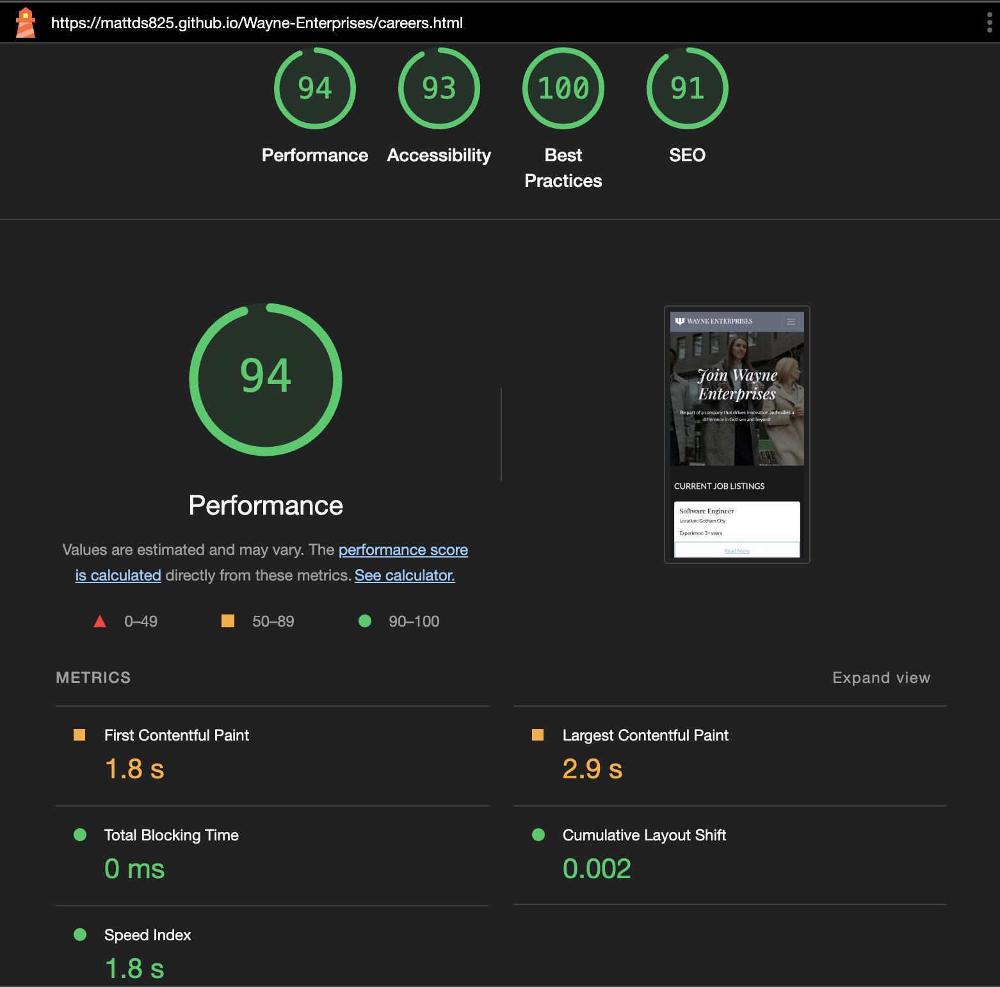
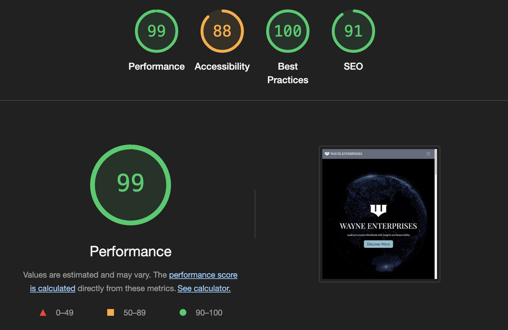
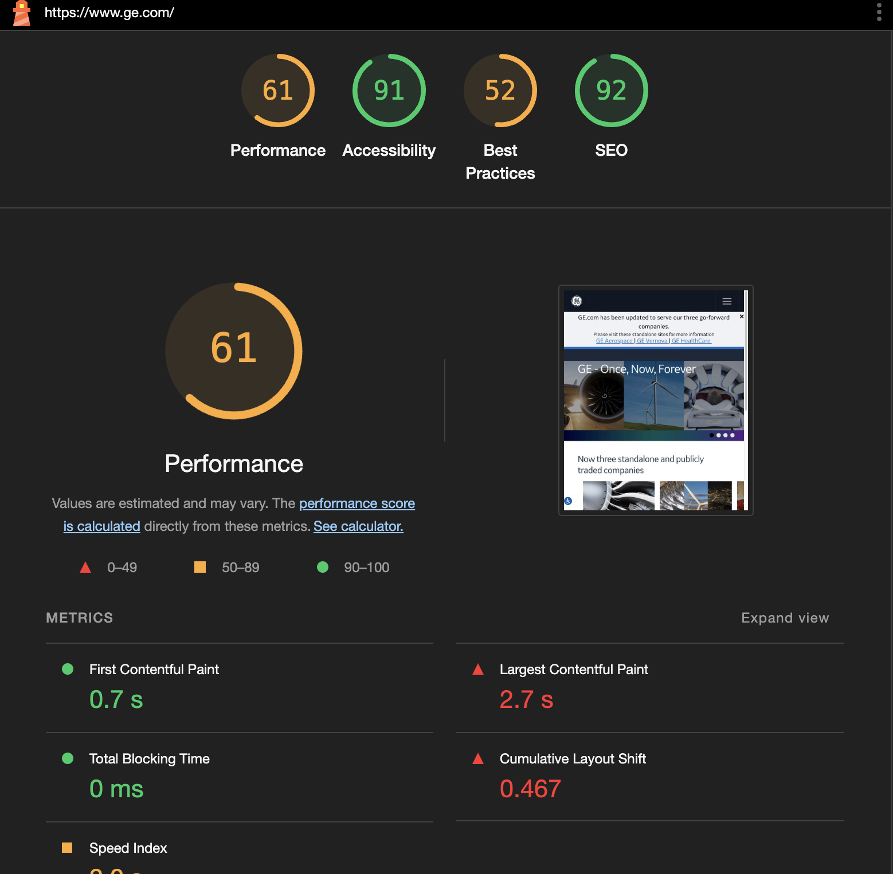

# Wayne Enterprises Testing

View Site -> [Wayne Enterprises](https://mattds825.github.io/Wayne-Enterprises/)

- - -

## CONTENTS

- [Solved Bugs](#solved-bugs)
- [Automated Testing](#automated-testing)
    * [W3C CSS Validator](#w3c-css-validator)
    * [W3C HTML Validator](#w3c-html-validator)
    * [Js Validator](#js-validator)
- [Performace Testing](#perfomance-testing)
    * [Considerations for Test Results](#considerations-for-test-results)
    * [Steps taken to Improve Performace](#steps-taken-to-improve-performance)
    * [Performace Score Research](#perfomrance-score-research)
- [Accesibility Testing](#accesibility-testing)
    * [Steps Taken to Improve Accesibililty](#steps-taken-to-improve-accesibility)
- [SEO](#seo)
    * [Steps Taken to Improve SEO](#steps-taken-to-imporve-seo)
- [Manual Testing](#manual-testing)
    * [User Story Testing](#user-story-testing)
    * [Full Testing](#full-testing)

## Solved Bugs

| Bug | Solution |
| ---| ----|
|hero video was not playing in mobile| added playsinline tag to video|

I did not encounter many bugs as this is a static page, most issues were solved during the development cycle

## Automated Testing 

### W3C CSS Validator

Used [W3C Schools CSS validator](https://jigsaw.w3.org/css-validator/validator?uri=https%3A%2F%2Fmattds825.github.io%2FWayne-Enterprises%2F&profile=css3svg&usermedium=all&warning=1&vextwarning=&lang=en)

### W3C HTML validator 

used [W3C Nu HTML Checker](https://validator.w3.org/)

please refer to the w3c-html-tests folder in the the documentation folder to view detailed tests before and after changes

-> [index.html](documentation/w3c-html-test/index-html-test-post.pdf): Passed all tests

-> [about-us.html](documentation/w3c-html-test/about-us-html-test-post.pdf): Passed all tests

-> [subsidiaries.html](documentation/w3c-html-test/subsidiaries-html-test-post.pdf): Passed all test

-> [corporate-responsibility.html](documentation/w3c-html-test/corporate-responsibility-html-test-post.pdf): Passed all tests

-> [investor-relations.html](documentation/w3c-html-test/investor-relations-html-test-post.pdf): Passed all tests

-> [contact-us.html](documentation/w3c-html-test/contact-us-html-test-post.pdf): Passed all tests

-> [careers.html](documentation/w3c-html-test/careers-html-test-post.pdf): Passed all tests

-> [under-construction.html](documentation/w3c-html-test/under-construction-html-test-post.pdf): Passed all tests

### JS Validator

used [JsHint](https://jshint.com/) to validate main.js file

-> main.js: **Passed**

## Perfomance Testing

Used [Google Lightouse](https://developer.chrome.com/docs/lighthouse/overview) for testing

scores are defined by Google as follows

[source](https://developer.chrome.com/docs/lighthouse/performance/performance-scoring)

- scores where obtained by running Lighthouse on Chrome Developer on each page around 5 for mobhile and desktop times and the highest score was taken. From this it is important ot note that the Lighthouse score can vary each time yoou run the test thus should be taken as a metric and not an absolute.

-> **Home Page**

|Desktop|Mobile|
|:-:|:-:|
|||

-> **About Us Page**

|Desktop|Mobile|
|:-:|:-:|
|||

-> **Subsidiaries Page**

|Desktop|Mobile|
|:-:|:-:|
|||

-> **Corporate Responsibility Page**

|Desktop|Mobile|
|:-:|:-:|
|||

-> **Investor Relations Page**

|Desktop|Mobile|
|:-:|:-:|
|||

-> **Contact Page**

|Desktop|Mobile|
|:-:|:-:|
|||

-> **Careers Page**

|Desktop|Mobile|
|:-:|:-:|
|||

-> **Under Construction Page**

|Desktop|Mobile|
|:-:|:-:|
|||

### Considerations For Test Results

Through some research I have found that the largest factors holding the score back are the following. I did take a lot of step to improve my store and these are related in the following section. But keep working on the score further woudl be a large time sink and would yield diminishing returns. Even according to Google: "taking a score from 99 to 100 needs about the same amount of metric improvement that would take a 90 to 94." [source](https://developer.chrome.com/docs/lighthouse/performance/performance-scoring) 

Improvement could be made but would require possible restructuring of the project or remove features that help the site stand out and is beyond the scope of the project. The following improvements could be considered if Lighouse score close to 100 on all test where needed:

-> **Boostrap**: this is a 3rd part import and takes up load resources
- could be improved import boostrap locally
- minifying boostrap css
- use a library like tailwind that purges unused css

->**Google Fonts**: this is a 3rd party font library that takes up load resources
- could locally import fonts to improve
- could compress fonts

->**Font Awesome**: This is a 3rd party icon libray that takes up load resources

->**Animations**: This animations take up contant load time
- could remove animations

### Steps Taken to improve performance

-> converted problematic images to webp format

-> compressed hero videos

-> added poster tag to videos

-> modyfing import scripts and links in head tag to "reduce block-size rendering"
    - added <code>defer = ""</code> attribute to 3rd party scripts
    - added <code>rel="preload" as="style" onload="this.rel='stylesheet'"</code> attribute to 3rd party links (bootsrap)
    - this saw a lighthouse increase of 88 to 90 on my index.html page which is one of the heaviest pages
    - these results where comperable in other pages generally going from 95 to 98
|Before|After|
|:-:|:-:|
|||

-> Changing the h1 animation had extreme imporvements in index.html and about-us.html
    - was previously using an [animation](https://animista.net/play/text/tracking-out) that effected the <code>letter-spacing</code> of the text, this cuased the layout to go through various shifts and greatly icreased load time
    - changing this animation to a [simpler one](https://animista.net/play/text/focus-in) that only used <code>filter</code> fixed this issue imporving the laod speed from around 90 to 99 in index.html and up to 95 in about-us.html.
    - I could probably see the same results in about-us.html but the video file used in the hero section is significantly larger, but I am happy with the score of 95 in performance
    
|Before|After|
|:-:|:-:|
|||

-> Adding a smaller video file that only gets shown to mobile devices, had a big inprovement in perfomance on mobile test (no efffect on desktop tests)
|Before|After|
|:-:|:-:|
|||

-> added smaller images to pages where the image load was generating  a lighthouse warning, set images that don't appear immediatly to <code>loading="lazy"</code>
- saw minor improvements in mobile performace scores

|Before|After|
|:-:|:-:|
|||

### Perfomrance Score Research

I wanted to do some light research to see the performance score on similar website, that being a conglomerate company that has a website that showcase their subsidiaries and industries they work in. I did this to compare to the score that I have achieved and see how they fare in relation to professional websites. The test was only conducted onm the home page of each site, and was repeated a few times to ensure the best score. Note: I appriciate that these websites probably have much heavier 3rd party dependencies than mine, so this test should not be taken as a direct comparison.

-> **ABB Group**
[page link](https://global.abb/group/en)

|Desktop|Mobile|
|:-:|:-:|
|||

-> **General Motors**
[page link](https://www.gm.com/)

|Desktop|Mobile|
|:-:|:-:|
|||

->**General Electrics**
[page link](https://www.ge.com/)

|Desktop|Mobile|
|:-:|:-:|
|||

## Accesibility Testing 

I used the web inspector [Audit Tool](https://developer.apple.com/videos/play/wwdc2019/514/#:~:text=Audits%20and%20audit%20results%20can,the%20nodes%20in%20the%20report.) to find accesibility issues on my website.

I also used [AC checker](https://websiteaccessibilitychecker.com/checker/index.php) to check for accesibility complience. 

In the audio I manged to get all scores up to 100%

and in the AC checker I managed to remove all errors except for one regarding the heading nesting in my footer. But this didnt effect the Accesibiblty Audit so I left it.

-> **Home Page Accesibililty Audit**

-> **About Us Page Accesibililty Audit**

-> **Subsidiaries Page Accesibililty Audit**

-> **Corporate Responsibility Page Accesibililty Audit**

-> **Investor Relations Page Accesibililty Audit**

-> **Contact Page Accesibililty Audit**

-> **Careers Page Accesibililty Audit**

-> **Under Construction Page Accesibililty Audit**

### Steps taken to improve Accesibility

- used <code>title</code> attribute on links
- used <code>span</code> instead of <code>i</code> for icons

these two saw improvements in Accesibillity results on both the Audit and the AC checker

|Before|After|
|:-:|:-:|
|||
|||

## SEO

### Steps taken to imporve SEO

-> added meta description tags to each page in the website
 - this increase the SEO score in lighthouse from 82 to 91

## Manual Testing

### User Story Testing

--> Insert full user testing here

### Full Testing

--> Insert Full Testing Here