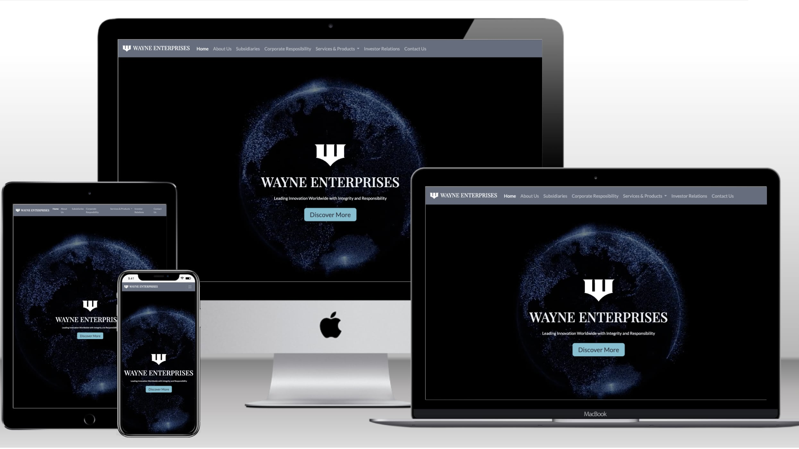

# Wayne Enterprises Testing

View Site -> [Wayne Enterprises](https://mattds825.github.io/Wayne-Enterprises/)

- - -

## CONTENTS

- [Solved Bugs](#solved-bugs)
- [Automated Testing](#automated-testing)
    * [W3C CSS Validator](#w3c-css-validator)
    * [W3C HTML Validator](#w3c-html-validator)
    * [Js Validator](#js-validator)
- [Performace Testing](#perfomance-testing)
    * [Considerations for Test Results](#considerations-for-test-results)
    * [Steps taken to Improve Performace](#steps-taken-to-improve-performance)
    * [Performace Score Research](#perfomrance-score-research)
- [Accesibility Testing](#accesibility-testing)
    * [Steps Taken to Improve Accesibililty](#steps-taken-to-improve-accesibility)
- [SEO](#seo)
    * [Steps Taken to Improve SEO](#steps-taken-to-imporve-seo)
- [Manual Testing](#manual-testing)
    * [User Story Testing](#user-story-testing)
    * [Full Testing](#full-testing)

## Solved Bugs

| Bug | Solution |
| ---| ----|
|hero video was not playing in mobile| added playsinline tag to video|

I did not encounter many bugs as this is a static page, most issues were solved during the development cycle

## Automated Testing 

### W3C CSS Validator

Used [W3C Schools CSS validator](https://jigsaw.w3.org/css-validator/validator?uri=https%3A%2F%2Fmattds825.github.io%2FWayne-Enterprises%2F&profile=css3svg&usermedium=all&warning=1&vextwarning=&lang=en)

### W3C HTML validator 

used [W3C Nu HTML Checker](https://validator.w3.org/)

please refer to the w3c-html-tests folder in the the documentation folder to view detailed tests before and after changes

-> [index.html](documentation/w3c-html-test/index-html-test-post.pdf): Passed all tests

-> [about-us.html](documentation/w3c-html-test/about-us-html-test-post.pdf): Passed all tests

-> [subsidiaries.html](documentation/w3c-html-test/subsidiaries-html-test-post.pdf): Passed all test

-> [corporate-responsibility.html](documentation/w3c-html-test/corporate-responsibility-html-test-post.pdf): Passed all tests

-> [investor-relations.html](documentation/w3c-html-test/investor-relations-html-test-post.pdf): Passed all tests

-> [contact-us.html](documentation/w3c-html-test/contact-us-html-test-post.pdf): Passed all tests

-> [careers.html](documentation/w3c-html-test/careers-html-test-post.pdf): Passed all tests

-> [under-construction.html](documentation/w3c-html-test/under-construction-html-test-post.pdf): Passed all tests

### JS Validator

used [JsHint](https://jshint.com/) to validate main.js file

-> main.js: **Passed**

## Perfomance Testing

Used [Google Lightouse](https://developer.chrome.com/docs/lighthouse/overview) for testing

scores are defined by Google as follows

[source](https://developer.chrome.com/docs/lighthouse/performance/performance-scoring)

- scores where obtained by running Lighthouse on Chrome Developer on each page around 5 for mobhile and desktop times and the highest score was taken. From this it is important ot note that the Lighthouse score can vary each time yoou run the test thus should be taken as a metric and not an absolute.

-> **Home Page**

|Desktop|Mobile|
|:-:|:-:|
|||

-> **About Us Page**

|Desktop|Mobile|
|:-:|:-:|
|||

-> **Subsidiaries Page**

|Desktop|Mobile|
|:-:|:-:|
|||

-> **Corporate Responsibility Page**

|Desktop|Mobile|
|:-:|:-:|
|||

-> **Investor Relations Page**

|Desktop|Mobile|
|:-:|:-:|
|||

-> **Contact Page**

|Desktop|Mobile|
|:-:|:-:|
|||

-> **Careers Page**

|Desktop|Mobile|
|:-:|:-:|
|||

-> **Under Construction Page**

|Desktop|Mobile|
|:-:|:-:|
|||

### Considerations For Test Results

Through some research I have found that the largest factors holding the score back are the following. I did take a lot of step to improve my store and these are related in the following section. But keep working on the score further woudl be a large time sink and would yield diminishing returns. Even according to Google: "taking a score from 99 to 100 needs about the same amount of metric improvement that would take a 90 to 94." [source](https://developer.chrome.com/docs/lighthouse/performance/performance-scoring) 

Improvement could be made but would require possible restructuring of the project or remove features that help the site stand out and is beyond the scope of the project. The following improvements could be considered if Lighouse score close to 100 on all test where needed:

-> **Boostrap**: this is a 3rd part import and takes up load resources
- could be improved import boostrap locally
- minifying boostrap css
- use a library like tailwind that purges unused css

->**Google Fonts**: this is a 3rd party font library that takes up load resources
- could locally import fonts to improve
- could compress fonts

->**Font Awesome**: This is a 3rd party icon libray that takes up load resources

->**Animations**: This animations take up contant load time
- could remove animations

### Steps Taken to improve performance

-> converted problematic images to webp format

-> compressed hero videos

-> added poster tag to videos

-> modyfing import scripts and links in head tag to "reduce block-size rendering"
    - added <code>defer = ""</code> attribute to 3rd party scripts
    - added <code>rel="preload" as="style" onload="this.rel='stylesheet'"</code> attribute to 3rd party links (bootsrap)
    - this saw a lighthouse increase of 88 to 90 on my index.html page which is one of the heaviest pages
    - these results where comperable in other pages generally going from 95 to 98
|Before|After|
|:-:|:-:|
|||

-> Changing the h1 animation had extreme imporvements in index.html and about-us.html
    - was previously using an [animation](https://animista.net/play/text/tracking-out) that effected the <code>letter-spacing</code> of the text, this cuased the layout to go through various shifts and greatly icreased load time
    - changing this animation to a [simpler one](https://animista.net/play/text/focus-in) that only used <code>filter</code> fixed this issue imporving the laod speed from around 90 to 99 in index.html and up to 95 in about-us.html.
    - I could probably see the same results in about-us.html but the video file used in the hero section is significantly larger, but I am happy with the score of 95 in performance
    
|Before|After|
|:-:|:-:|
|||

-> Adding a smaller video file that only gets shown to mobile devices, had a big inprovement in perfomance on mobile test (no efffect on desktop tests)
|Before|After|
|:-:|:-:|
|||

-> added smaller images to pages where the image load was generating  a lighthouse warning, set images that don't appear immediatly to <code>loading="lazy"</code>
- saw minor improvements in mobile performace scores

|Before|After|
|:-:|:-:|
|||

### Perfomrance Score Research

I wanted to do some light research to see the performance score on similar website, that being a conglomerate company that has a website that showcase their subsidiaries and industries they work in. I did this to compare to the score that I have achieved and see how they fare in relation to professional websites. The test was only conducted onm the home page of each site, and was repeated a few times to ensure the best score. Note: I appriciate that these websites probably have much heavier 3rd party dependencies than mine, so this test should not be taken as a direct comparison.

-> **ABB Group**
[page link](https://global.abb/group/en)

|Desktop|Mobile|
|:-:|:-:|
|||

-> **General Motors**
[page link](https://www.gm.com/)

|Desktop|Mobile|
|:-:|:-:|
|||

->**General Electrics**
[page link](https://www.ge.com/)

|Desktop|Mobile|
|:-:|:-:|
|||

## Accesibility Testing 

I used the web inspector [Audit Tool](https://developer.apple.com/videos/play/wwdc2019/514/#:~:text=Audits%20and%20audit%20results%20can,the%20nodes%20in%20the%20report.) to find accesibility issues on my website.

I also used [AC checker](https://websiteaccessibilitychecker.com/checker/index.php) to check for accesibility complience. 

In the audio I manged to get all scores up to 100%

and in the AC checker I managed to remove all errors except for one regarding the heading nesting in my footer. But this didnt effect the Accesibiblty Audit so I left it.

-> **Home Page Accesibililty Audit**

-> **About Us Page Accesibililty Audit**

-> **Subsidiaries Page Accesibililty Audit**

-> **Corporate Responsibility Page Accesibililty Audit**

-> **Investor Relations Page Accesibililty Audit**

-> **Contact Page Accesibililty Audit**

-> **Careers Page Accesibililty Audit**

-> **Under Construction Page Accesibililty Audit**

### Steps taken to improve Accesibility

- used <code>title</code> attribute on links
- used <code>span</code> instead of <code>i</code> for icons

these two saw improvements in Accesibillity results on both the Audit and the AC checker

|Before|After|
|:-:|:-:|
|||
|||

## SEO

### Steps taken to imporve SEO

-> added meta description tags to each page in the website
 - this increase the SEO score in lighthouse from 82 to 91

## Manual Testing

### User Story Testing

These are test carried out to match the User Stories defined in [README.md](README.md)

-> **General Information Seeker**

| Goals| How are they acheived|
|--------------------------------------------------------------------------------------------------|---------------------------------------------------------------------------------------------------------------------------------------------------|
| User should be greeted with a clean website and some information they can read about the company | The Home page has a smooth animation and a professional look. The use can view some of the most recent newsletter stories if they scroll dow      |
| User should be able to easily navigate between pages                                             | The navigation bar gives users quick access to the most important pages and the footer gives them quick links to pages they might be looking for  |
| User should be able to find information on general question                                      | The user can view the FAQ section in the contact page, they can also access this from the quick link in the footer                                |
| User should be able to find information about the company's values                               | The user can navigate to the corporate responsibility page to view all the initiatives and values of the company                                  |
| User can find information about the Company's Subsidiaries                                       | The user can find this information in the Subsidiaries page                                                                                       |
| The site should be responsive on whatever device the user has                                    | The site has a responsive layout that changes for desktop, tablet and mobile                                                                      |

-> **Pontential Investor**

The goals from the privous group carry over

| Goals| How are they acheived|
|------------------------------------------------------------|-------------------------------------------------------------------------------------------------|
| User should be able to see financial status of the company | The investor relations shows the current stock graph                                            |
| User should be able to view financial reports              | The Investor Relations page allows the user to view latest financial reports and press releases |

-> **Potential Employees**

The goals from the General Info user carry over

| Goals| How are they acheived|
|-------------------------------------------------------------------------------|--------------------------------------------------------------------------------------|
| User should be able to find the careers page                                  | Careers page position in footer as is standard on most company websites              |
| User should be able to browse job openings                                    | The Careers page shows all the recent job openings                                   |
| User should be able to see Employee Benefits and Company Values               | The Careers page shows the benefits in a nice way and highlight the company values   |
| User should be able to see information about Interships and Register Interest | The Careers page has a Internships section that allows the user to register interest |

### Full Testing

For tesing the following devices where used

- Macbook por 13", also on 27" monitor
- Iphone 15
- Iphone 13 pro max
- Ipad pro 12"

Also the following browsers where tested 

- Safari 
- Chrome

-> **Home Page**

| Feature                    | Expected Outcome                                                                                                                                                                                                      | Test Performed                                              | Result                                                                                                                                                                                                                                                                                               | Pass/Fail |
|----------------------------|-----------------------------------------------------------------------------------------------------------------------------------------------------------------------------------------------------------------------|-------------------------------------------------------------|------------------------------------------------------------------------------------------------------------------------------------------------------------------------------------------------------------------------------------------------------------------------------------------------------|-----------|
| Navbar - The Icon          | Takes user to home page                                                                                                                                                                                               | clicked on the icon                                         | Home page loads                                                                                                                                                                                                                                                                                      | Pass      |
| Navbar - Links             | Each link should take user to the correct page                                                                                                                                                                        | clicked on the links to see what page loads                 | The corresponding page to the link clicked loads                                                                                                                                                                                                                                                     | Pass      |
| Navbar - Hamburger Icon    | Navbar should collapse into a hamburger icon when screen is smaller than desktop                                                                                                                                      | opened page in mobile and tablet sized devices              | Navbar shown as a hamburger icon                                                                                                                                                                                                                                                                     | Pass      |
| Navabr - Expanded Navbar   | On mobile the navbar should expend when the hamburger icon is clicked, should close when clicked again                                                                                                                | clicked the hamburger icon, and then clicked again          | Navbar expanded, then closed correctly                                                                                                                                                                                                                                                               | Pass      |
| Footer - Internal Links    | The internal links should open the correct page or section in a page it is refereeing  Subscribe to Newsletter button should open under construction page and so should Terms and conditions and Privacy policy links | clicked all internal links                                  | About Us, Subsidiaries, Corporate Responsibility, Careers, Investor Relations and Contact link open correct page FAQ link opens FAQ section in Contact page Subscscribe to Newsletter button opens Under Construction page Terms and condition and privacy policy link open under construction page  | Pass      |
| Footer - Social Links      | The Social links should open the corresponding social media site in a new tab                                                                                                                                         | clicked on the social media icons                           | New tab opened with the page of the corresponding social media site                                                                                                                                                                                                                                  | Pass      |
| Footer - Responsive        | The footer should be responsive and collapse down to rows on mobile devices                                                                                                                                           | opened page on a mobile device                              | footer displayed in rows                                                                                                                                                                                                                                                                             | Pass      |
| Fonts                      | Correct fonts are loaded                                                                                                                                                                                              | opened page on all devices                                  | correct font is observerd                                                                                                                                                                                                                                                                            | Pass      |
| Animations - Initail       | Initial animations is shown as page loads                                                                                                                                                                             | loaded page                                                 | animation is shown                                                                                                                                                                                                                                                                                   | Pass      |
| Animations - On Scroll     | elements that should be animated get animated once on scroll                                                                                                                                                          | loaded page and scrolled down                               | animated elements correctly animate when they are scrolled to                                                                                                                                                                                                                                        | Pass      |
| Layout - Responsive        | Correct layout is show for the corresponding device                                                                                                                                                                   | loaded page on mobile, tablet and desktop devices           | correct layout is observed                                                                                                                                                                                                                                                                           | Pass      |
| Images / Video             | Correct image / video is shown based on the device's screen size                                                                                                                                                      | openen page on mobile, tablet and desktop                   | Correct Image / Video loaded                                                                                                                                                                                                                                                                         | Pass      |
| Buttons - Hover            | All Buttons give visual feedback when the user hovers over them with a mouse                                                                                                                                          | hovered over the button with the cursor                     | Button is changed to show visual feedback on hover                                                                                                                                                                                                                                                   | Pass      |
| Home Page Video            | Displays poster image that is a Frame of the video, then video is loaded and plays on loop                                                                                                                            | opened home page on mobile, tablet and desktop              | image of first frame of the video is shown for a few second and then video starts playing and loops                                                                                                                                                                                                  | Pass      |
| "Discover More" Button     | Should scroll user down to the newsletter section on the page                                                                                                                                                         | clicked the "Discover More" button                          | scrolls down to newsletter section                                                                                                                                                                                                                                                                   | Pass      |
| "Read More" Buttons        | Should open the "Under Construction" page                                                                                                                                                                             | Clicked each of the "Read More" Buttons in the news stories | Under Construction page opens                                                                                                                                                                                                                                                                        | Pass      |
| "Read More Stories" Button | Should open the "Under Construction" page                                                                                                                                                                             | Clicked the Read more stories button                        | Under Construction page opens                                                                                                                                                                                                                                                                        | Pass      |

-> **About Us Page**

| Feature                  | Expected Outcome                                                                                                                                                                                                      | Test Performed                                                                             | Result                                                                                                                                                                                                                                                                                               | Pass/Fail |
|--------------------------|-----------------------------------------------------------------------------------------------------------------------------------------------------------------------------------------------------------------------|--------------------------------------------------------------------------------------------|------------------------------------------------------------------------------------------------------------------------------------------------------------------------------------------------------------------------------------------------------------------------------------------------------|-----------|
| Navbar - The Icon        | Takes user to home page                                                                                                                                                                                               | clicked on the icon                                                                        | Home page loads                                                                                                                                                                                                                                                                                      | Pass      |
| Navbar - Links           | Each link should take user to the correct page                                                                                                                                                                        | clicked on the links to see what page loads                                                | The corresponding page to the link clicked loads                                                                                                                                                                                                                                                     | Pass      |
| Navbar - Hamburger Icon  | Navbar should collapse into a hamburger icon when screen is smaller than desktop                                                                                                                                      | opened page in mobile and tablet sized devices                                             | Navbar shown as a hamburger icon                                                                                                                                                                                                                                                                     | Pass      |
| Navabr - Expanded Navbar | On mobile the navbar should expend when the hamburger icon is clicked, should close when clicked again                                                                                                                | clicked the hamburger icon, and then clicked again                                         | Navbar expanded, then closed correctly                                                                                                                                                                                                                                                               | Pass      |
| Footer - Internal Links  | The internal links should open the correct page or section in a page it is refereeing  Subscribe to Newsletter button should open under construction page and so should Terms and conditions and Privacy policy links | clicked all internal links                                                                 | About Us, Subsidiaries, Corporate Responsibility, Careers, Investor Relations and Contact link open correct page FAQ link opens FAQ section in Contact page Subscscribe to Newsletter button opens Under Construction page Terms and condition and privacy policy link open under construction page  | Pass      |
| Footer - Social Links    | The Social links should open the corresponding social media site in a new tab                                                                                                                                         | clicked on the social media icons                                                          | New tab opened with the page of the corresponding social media site                                                                                                                                                                                                                                  | Pass      |
| Footer - Responsive      | The footer should be responsive and collapse down to rows on mobile devices                                                                                                                                           | opened page on a mobile device                                                             | footer displayed in rows                                                                                                                                                                                                                                                                             | Pass      |
| Fonts                    | Correct fonts are loaded                                                                                                                                                                                              | opened page on all devices                                                                 | correct font is observerd                                                                                                                                                                                                                                                                            | Pass      |
| Animations - Initail     | Initial animations is shown as page loads                                                                                                                                                                             | loaded page                                                                                | animation is shown                                                                                                                                                                                                                                                                                   | Pass      |
| Animations - On Scroll   | elements that should be animated get animated once on scroll                                                                                                                                                          | loaded page and scrolled down                                                              | animated elements correctly animate when they are scrolled to                                                                                                                                                                                                                                        | Pass      |
| Layout - Responsive      | Correct layout is show for the corresponding device                                                                                                                                                                   | loaded page on mobile, tablet and desktop devices                                          | correct layout is observed                                                                                                                                                                                                                                                                           | Pass      |
| Images / Video           | Correct image / video is shown based on the device's screen size                                                                                                                                                      | openen page on mobile, tablet and desktop                                                  | Correct Image / Video loaded                                                                                                                                                                                                                                                                         | Pass      |
| Buttons - Hover          | All Buttons give visual feedback when the user hovers over them with a mouse                                                                                                                                          | hovered over the button with the cursor                                                    | Button is changed to show visual feedback on hover                                                                                                                                                                                                                                                   | Pass      |
| About Us Page Video      | Displays poster image that is a Frame of the video, then video is loaded and plays on loop                                                                                                                            | opened page on mobile, tablet and desktop                                                  | image of first frame of the video is shown for a few second and then video starts playing and loops                                                                                                                                                                                                  | Pass      |
| "Read More" Button       | Should scroll user down to the Values section on the page                                                                                                                                                             | clicked the "Read More" button                                                             | scrolls down to Values section                                                                                                                                                                                                                                                                       | Pass      |
| Values Section           | Shows correct custom layouts for mobile, tablet and desktop                                                                                                                                                           | opened the about use page and scrolled to the values section on mobile, tablet and desktop | Correct layout observed                                                                                                                                                                                                                                                                              | Pass      |
| Timeline                 | shows correct images and layout for desktop and mobile devices                                                                                                                                                        | opened page on mobile and desktop                                                          | correct layout and images observed                                                                                                                                                                                                                                                                   | Pass      |
| Leadership section       | should show all columns on tablet and desktop, but be shown as a carousel on mobile carousel on mobile should cycle left and right when user clicks icon                                                              | scrolled to leadership section on mobile clicked the arrows to cycle between cards         | correct layout observed on mobile arrow buttons work as inteded                                                                                                                                                                                                                                      | Pass      |

-> **Subsidiaries Page**

| Feature                  | Expected Outcome                                                                                                                                                                                                      | Test Performed                                     | Result                                                                                                                                                                                                                                                                                               | Pass/Fail |
|--------------------------|-----------------------------------------------------------------------------------------------------------------------------------------------------------------------------------------------------------------------|----------------------------------------------------|------------------------------------------------------------------------------------------------------------------------------------------------------------------------------------------------------------------------------------------------------------------------------------------------------|-----------|
| Navbar - The Icon        | Takes user to home page                                                                                                                                                                                               | clicked on the icon                                | Home page loads                                                                                                                                                                                                                                                                                      | Pass      |
| Navbar - Links           | Each link should take user to the correct page                                                                                                                                                                        | clicked on the links to see what page loads        | The corresponding page to the link clicked loads                                                                                                                                                                                                                                                     | Pass      |
| Navbar - Hamburger Icon  | Navbar should collapse into a hamburger icon when screen is smaller than desktop                                                                                                                                      | opened page in mobile and tablet sized devices     | Navbar shown as a hamburger icon                                                                                                                                                                                                                                                                     | Pass      |
| Navabr - Expanded Navbar | On mobile the navbar should expend when the hamburger icon is clicked, should close when clicked again                                                                                                                | clicked the hamburger icon, and then clicked again | Navbar expanded, then closed correctly                                                                                                                                                                                                                                                               | Pass      |
| Footer - Internal Links  | The internal links should open the correct page or section in a page it is refereeing  Subscribe to Newsletter button should open under construction page and so should Terms and conditions and Privacy policy links | clicked all internal links                         | About Us, Subsidiaries, Corporate Responsibility, Careers, Investor Relations and Contact link open correct page FAQ link opens FAQ section in Contact page Subscscribe to Newsletter button opens Under Construction page Terms and condition and privacy policy link open under construction page  | Pass      |
| Footer - Social Links    | The Social links should open the corresponding social media site in a new tab                                                                                                                                         | clicked on the social media icons                  | New tab opened with the page of the corresponding social media site                                                                                                                                                                                                                                  | Pass      |
| Footer - Responsive      | The footer should be responsive and collapse down to rows on mobile devices                                                                                                                                           | opened page on a mobile device                     | footer displayed in rows                                                                                                                                                                                                                                                                             | Pass      |
| Fonts                    | Correct fonts are loaded                                                                                                                                                                                              | opened page on all devices                         | correct font is observerd                                                                                                                                                                                                                                                                            | Pass      |
| Animations - Initail     | Initial animations is shown as page loads                                                                                                                                                                             | loaded page                                        | animation is shown                                                                                                                                                                                                                                                                                   | Pass      |
| Animations - On Scroll   | elements that should be animated get animated once on scroll                                                                                                                                                          | loaded page and scrolled down                      | animated elements correctly animate when they are scrolled to                                                                                                                                                                                                                                        | Pass      |
| Layout - Responsive      | Correct layout is show for the corresponding device                                                                                                                                                                   | loaded page on mobile, tablet and desktop devices  | correct layout is observed                                                                                                                                                                                                                                                                           | Pass      |
| Images                   | Correct image is shown based on the device's screen size                                                                                                                                                              | openen page on mobile, tablet and desktop          | Correct Image loaded                                                                                                                                                                                                                                                                                 | Pass      |
| Buttons - Hover          | All Buttons give visual feedback when the user hovers over them with a mouse                                                                                                                                          | hovered over the button with the cursor            | Button is changed to show visual feedback on hover                                                                                                                                                                                                                                                   | Pass      |
| "Read More" Buttons      | Under Construction Page should be opened                                                                                                                                                                              | clicked the "Read More" buttons                    | Under Construction page is opened                                                                                                                                                                                                                                                                    | Pass      |
| Subsidiaries Section     | Should show columns for desktop and tablet, should show rows for mobile correct images should be loaded based on device size                                                                                          | scrolled the Subsidiaries section                  | Correct layout is observed correct images are loaded                                                                                                                                                                                                                                                 |           |
| Map Section              | Correct Layout should be shown and map pins should pulse                                                                                                                                                              | scrolled the map section                           | correct layout and animation observed                                                                                                                                                                                                                                                                | Pass      |

-> **Corporate Responsibility**

| Feature                    | Expected Outcome                                                                                                                                                                                                      | Test Performed                                                                                              | Result                                                                                                                                                                                                                                                                                               | Pass/Fail |
|----------------------------|-----------------------------------------------------------------------------------------------------------------------------------------------------------------------------------------------------------------------|-------------------------------------------------------------------------------------------------------------|------------------------------------------------------------------------------------------------------------------------------------------------------------------------------------------------------------------------------------------------------------------------------------------------------|-----------|
| Navbar - The Icon          | Takes user to home page                                                                                                                                                                                               | clicked on the icon                                                                                         | Home page loads                                                                                                                                                                                                                                                                                      | Pass      |
| Navbar - Links             | Each link should take user to the correct page                                                                                                                                                                        | clicked on the links to see what page loads                                                                 | The corresponding page to the link clicked loads                                                                                                                                                                                                                                                     | Pass      |
| Navbar - Hamburger Icon    | Navbar should collapse into a hamburger icon when screen is smaller than desktop                                                                                                                                      | opened page in mobile and tablet sized devices                                                              | Navbar shown as a hamburger icon                                                                                                                                                                                                                                                                     | Pass      |
| Navabr - Expanded Navbar   | On mobile the navbar should expend when the hamburger icon is clicked, should close when clicked again                                                                                                                | clicked the hamburger icon, and then clicked again                                                          | Navbar expanded, then closed correctly                                                                                                                                                                                                                                                               | Pass      |
| Footer - Internal Links    | The internal links should open the correct page or section in a page it is refereeing  Subscribe to Newsletter button should open under construction page and so should Terms and conditions and Privacy policy links | clicked all internal links                                                                                  | About Us, Subsidiaries, Corporate Responsibility, Careers, Investor Relations and Contact link open correct page FAQ link opens FAQ section in Contact page Subscscribe to Newsletter button opens Under Construction page Terms and condition and privacy policy link open under construction page  | Pass      |
| Footer - Social Links      | The Social links should open the corresponding social media site in a new tab                                                                                                                                         | clicked on the social media icons                                                                           | New tab opened with the page of the corresponding social media site                                                                                                                                                                                                                                  | Pass      |
| Footer - Responsive        | The footer should be responsive and collapse down to rows on mobile devices                                                                                                                                           | opened page on a mobile device                                                                              | footer displayed in rows                                                                                                                                                                                                                                                                             | Pass      |
| Fonts                      | Correct fonts are loaded                                                                                                                                                                                              | opened page on all devices                                                                                  | correct font is observerd                                                                                                                                                                                                                                                                            | Pass      |
| Animations - Initail       | Initial animations is shown as page loads                                                                                                                                                                             | loaded page                                                                                                 | animation is shown                                                                                                                                                                                                                                                                                   | Pass      |
| Animations - On Scroll     | elements that should be animated get animated once on scroll                                                                                                                                                          | loaded page and scrolled down                                                                               | animated elements correctly animate when they are scrolled to                                                                                                                                                                                                                                        | Pass      |
| Layout - Responsive        | Correct layout is show for the corresponding device                                                                                                                                                                   | loaded page on mobile, tablet and desktop devices                                                           | correct layout is observed                                                                                                                                                                                                                                                                           | Pass      |
| Images                     | Correct image is shown based on the device's screen size                                                                                                                                                              | openen page on mobile, tablet and desktop                                                                   | Correct Image loaded                                                                                                                                                                                                                                                                                 | Pass      |
| Buttons - Hover            | All Buttons give visual feedback when the user hovers over them with a mouse                                                                                                                                          | hovered over the button with the cursor                                                                     | Button is changed to show visual feedback on hover                                                                                                                                                                                                                                                   | Pass      |
| "Read More" Buttons        | Under Construction Page should be opened                                                                                                                                                                              | clicked the "Read More" buttons in the environmental initiatives section and the community projects section | Under Construction page is opened                                                                                                                                                                                                                                                                    | Pass      |
| Core Tenets Section        | Should show columns for desktop and tablet and rows for mobile should have a slight hover effect when user goes over the Tenet boxes with the cursor                                                                  | Opened page on all devices hovered over tenet boxes on desktop                                              | Correct layout observes on all devices Slight hover effect shown correctly                                                                                                                                                                                                                           | Pass      |
| Philanthropic work section | should have correct layout and accordion box should open and close when item is clicked                                                                                                                               | Opened page on all devices clicked the items of the accordion                                               | correct layout observed accordion items expand and close correctly                                                                                                                                                                                                                                   | Pass      |
| Community Projects Section | Should have be shown as rows on tablet and desktop and as columns on mobile User should be able to click the next page icon below the cards to see the other page of cards                                            | scrolled the the community projects section on mobile, tablet and desktop clicked the page indicators       | Correct layout observed page indicators work as inteded                                                                                                                                                                                                                                              | Pass      |

-> **Investor Relations Page**

| Feature                                                             | Expected Outcome                                                                                                                                                                                                      | Test Performed                                               | Result                                                                                                                                                                                                                                                                                               | Pass/Fail |
|---------------------------------------------------------------------|-----------------------------------------------------------------------------------------------------------------------------------------------------------------------------------------------------------------------|--------------------------------------------------------------|------------------------------------------------------------------------------------------------------------------------------------------------------------------------------------------------------------------------------------------------------------------------------------------------------|-----------|
| Navbar - The Icon                                                   | Takes user to home page                                                                                                                                                                                               | clicked on the icon                                          | Home page loads                                                                                                                                                                                                                                                                                      | Pass      |
| Navbar - Links                                                      | Each link should take user to the correct page                                                                                                                                                                        | clicked on the links to see what page loads                  | The corresponding page to the link clicked loads                                                                                                                                                                                                                                                     | Pass      |
| Navbar - Hamburger Icon                                             | Navbar should collapse into a hamburger icon when screen is smaller than desktop                                                                                                                                      | opened page in mobile and tablet sized devices               | Navbar shown as a hamburger icon                                                                                                                                                                                                                                                                     | Pass      |
| Navabr - Expanded Navbar                                            | On mobile the navbar should expend when the hamburger icon is clicked, should close when clicked again                                                                                                                | clicked the hamburger icon, and then clicked again           | Navbar expanded, then closed correctly                                                                                                                                                                                                                                                               | Pass      |
| Footer - Internal Links                                             | The internal links should open the correct page or section in a page it is refereeing  Subscribe to Newsletter button should open under construction page and so should Terms and conditions and Privacy policy links | clicked all internal links                                   | About Us, Subsidiaries, Corporate Responsibility, Careers, Investor Relations and Contact link open correct page FAQ link opens FAQ section in Contact page Subscscribe to Newsletter button opens Under Construction page Terms and condition and privacy policy link open under construction page  | Pass      |
| Footer - Social Links                                               | The Social links should open the corresponding social media site in a new tab                                                                                                                                         | clicked on the social media icons                            | New tab opened with the page of the corresponding social media site                                                                                                                                                                                                                                  | Pass      |
| Footer - Responsive                                                 | The footer should be responsive and collapse down to rows on mobile devices                                                                                                                                           | opened page on a mobile device                               | footer displayed in rows                                                                                                                                                                                                                                                                             | Pass      |
| Fonts                                                               | Correct fonts are loaded                                                                                                                                                                                              | opened page on all devices                                   | correct font is observerd                                                                                                                                                                                                                                                                            | Pass      |
| Animations - Initail                                                | Initial animations is shown as page loads                                                                                                                                                                             | loaded page                                                  | animation is shown                                                                                                                                                                                                                                                                                   | Pass      |
| Animations - On Scroll                                              | elements that should be animated get animated once on scroll                                                                                                                                                          | loaded page and scrolled down                                | animated elements correctly animate when they are scrolled to                                                                                                                                                                                                                                        | Pass      |
| Layout - Responsive                                                 | Correct layout is show for the corresponding device                                                                                                                                                                   | loaded page on mobile, tablet and desktop devices            | correct layout is observed                                                                                                                                                                                                                                                                           | Pass      |
| Images                                                              | Correct image is shown based on the device's screen size                                                                                                                                                              | openen page on mobile, tablet and desktop                    | Correct Image loaded                                                                                                                                                                                                                                                                                 | Pass      |
| Buttons - Hover                                                     | All Buttons give visual feedback when the user hovers over them with a mouse                                                                                                                                          | hovered over the button with the cursor                      | Button is changed to show visual feedback on hover                                                                                                                                                                                                                                                   | Pass      |
| "Quarterly Report Q1 2024" Button "Quarterly Report Q2 2024" Button | Correct report decoument should be opened in a new tab                                                                                                                                                                | clicked the "Quarterly Report..." buttons                    | Correct Report is opened in a new tab                                                                                                                                                                                                                                                                | Pass      |
| "Anual Report 2023" Button                                          | Annual Report should be opened in a new tab                                                                                                                                                                           | clicken the "Annual Report 2023" Button                      | Annual Report is opened in new tab                                                                                                                                                                                                                                                                   | Pass      |
| "Read More" Buttons - Press release section                         | Should open the correct document in a new tab                                                                                                                                                                         | clicked the "Read More" button in the press releases section | Correct document is opened in new tab                                                                                                                                                                                                                                                                | Pass          |

-> **Contact Us Page**

| Feature                      | Expected Outcome                                                                                                                                                                                                      | Test Performed                                     | Result                                                                                                                                                                                                                                                                                               | Pass/Fail |
|------------------------------|-----------------------------------------------------------------------------------------------------------------------------------------------------------------------------------------------------------------------|----------------------------------------------------|------------------------------------------------------------------------------------------------------------------------------------------------------------------------------------------------------------------------------------------------------------------------------------------------------|-----------|
| Navbar - The Icon            | Takes user to home page                                                                                                                                                                                               | clicked on the icon                                | Home page loads                                                                                                                                                                                                                                                                                      | Pass      |
| Navbar - Links               | Each link should take user to the correct page                                                                                                                                                                        | clicked on the links to see what page loads        | The corresponding page to the link clicked loads                                                                                                                                                                                                                                                     | Pass      |
| Navbar - Hamburger Icon      | Navbar should collapse into a hamburger icon when screen is smaller than desktop                                                                                                                                      | opened page in mobile and tablet sized devices     | Navbar shown as a hamburger icon                                                                                                                                                                                                                                                                     | Pass      |
| Navabr - Expanded Navbar     | On mobile the navbar should expend when the hamburger icon is clicked, should close when clicked again                                                                                                                | clicked the hamburger icon, and then clicked again | Navbar expanded, then closed correctly                                                                                                                                                                                                                                                               | Pass      |
| Footer - Internal Links      | The internal links should open the correct page or section in a page it is refereeing  Subscribe to Newsletter button should open under construction page and so should Terms and conditions and Privacy policy links | clicked all internal links                         | About Us, Subsidiaries, Corporate Responsibility, Careers, Investor Relations and Contact link open correct page FAQ link opens FAQ section in Contact page Subscscribe to Newsletter button opens Under Construction page Terms and condition and privacy policy link open under construction page  | Pass      |
| Footer - Social Links        | The Social links should open the corresponding social media site in a new tab                                                                                                                                         | clicked on the social media icons                  | New tab opened with the page of the corresponding social media site                                                                                                                                                                                                                                  | Pass      |
| Footer - Responsive          | The footer should be responsive and collapse down to rows on mobile devices                                                                                                                                           | opened page on a mobile device                     | footer displayed in rows                                                                                                                                                                                                                                                                             | Pass      |
| Fonts                        | Correct fonts are loaded                                                                                                                                                                                              | opened page on all devices                         | correct font is observerd                                                                                                                                                                                                                                                                            | Pass      |
| Animations - Initail         | Initial animations is shown as page loads                                                                                                                                                                             | loaded page                                        | animation is shown                                                                                                                                                                                                                                                                                   | Pass      |
| Animations - On Scroll       | elements that should be animated get animated once on scroll                                                                                                                                                          | loaded page and scrolled down                      | animated elements correctly animate when they are scrolled to                                                                                                                                                                                                                                        | Pass      |
| Layout - Responsive          | Correct layout is show for the corresponding device                                                                                                                                                                   | loaded page on mobile, tablet and desktop devices  | correct layout is observed                                                                                                                                                                                                                                                                           | Pass      |
| Images                       | Correct image is shown based on the device's screen size                                                                                                                                                              | openen page on mobile, tablet and desktop          | Correct Image loaded                                                                                                                                                                                                                                                                                 | Pass      |
| Buttons - Hover              | All Buttons give visual feedback when the user hovers over them with a mouse                                                                                                                                          | hovered over the button with the cursor            | Button is changed to show visual feedback on hover                                                                                                                                                                                                                                                   | Pass      |
| Form                         | Should enforce the correct type of input                                                                                                                                                                              | filled out each field in the form                  | Correct input type is require, e.g. email, name. and autofill pops up                                                                                                                                                                                                                                | Pass      |
| FAQ Section - Accordion      | Items should expand and close correctly when clicked                                                                                                                                                                  | clicked each item of the accordion                 | Item correctly expands and closes when clicked by user                                                                                                                                                                                                                                               | Pass      |
| FAQ Section - Internal Links | Internal links should open correct page or element on page                                                                                                                                                            | clicked the links in the expanded accordion        | corresponding page opened when clicked the links                                                                                                                                                                                                                                                     | Pass      |

-> **Careers Page**

| Feature                       | Expected Outcome                                                                                                                                                                                                      | Test Performed                                              | Result                                                                                                                                                                                                                                                                                               | Pass/Fail |
|-------------------------------|-----------------------------------------------------------------------------------------------------------------------------------------------------------------------------------------------------------------------|-------------------------------------------------------------|------------------------------------------------------------------------------------------------------------------------------------------------------------------------------------------------------------------------------------------------------------------------------------------------------|-----------|
| Navbar - The Icon             | Takes user to home page                                                                                                                                                                                               | clicked on the icon                                         | Home page loads                                                                                                                                                                                                                                                                                      | Pass      |
| Navbar - Links                | Each link should take user to the correct page                                                                                                                                                                        | clicked on the links to see what page loads                 | The corresponding page to the link clicked loads                                                                                                                                                                                                                                                     | Pass      |
| Navbar - Hamburger Icon       | Navbar should collapse into a hamburger icon when screen is smaller than desktop                                                                                                                                      | opened page in mobile and tablet sized devices              | Navbar shown as a hamburger icon                                                                                                                                                                                                                                                                     | Pass      |
| Navabr - Expanded Navbar      | On mobile the navbar should expend when the hamburger icon is clicked, should close when clicked again                                                                                                                | clicked the hamburger icon, and then clicked again          | Navbar expanded, then closed correctly                                                                                                                                                                                                                                                               | Pass      |
| Footer - Internal Links       | The internal links should open the correct page or section in a page it is refereeing  Subscribe to Newsletter button should open under construction page and so should Terms and conditions and Privacy policy links | clicked all internal links                                  | About Us, Subsidiaries, Corporate Responsibility, Careers, Investor Relations and Contact link open correct page FAQ link opens FAQ section in Contact page Subscscribe to Newsletter button opens Under Construction page Terms and condition and privacy policy link open under construction page  | Pass      |
| Footer - Social Links         | The Social links should open the corresponding social media site in a new tab                                                                                                                                         | clicked on the social media icons                           | New tab opened with the page of the corresponding social media site                                                                                                                                                                                                                                  | Pass      |
| Footer - Responsive           | The footer should be responsive and collapse down to rows on mobile devices                                                                                                                                           | opened page on a mobile device                              | footer displayed in rows                                                                                                                                                                                                                                                                             | Pass      |
| Fonts                         | Correct fonts are loaded                                                                                                                                                                                              | opened page on all devices                                  | correct font is observerd                                                                                                                                                                                                                                                                            | Pass      |
| Animations - Initail          | Initial animations is shown as page loads                                                                                                                                                                             | loaded page                                                 | animation is shown                                                                                                                                                                                                                                                                                   | Pass      |
| Animations - On Scroll        | elements that should be animated get animated once on scroll                                                                                                                                                          | loaded page and scrolled down                               | animated elements correctly animate when they are scrolled to                                                                                                                                                                                                                                        | Pass      |
| Layout - Responsive           | Correct layout is show for the corresponding device                                                                                                                                                                   | loaded page on mobile, tablet and desktop devices           | correct layout is observed                                                                                                                                                                                                                                                                           | Pass      |
| Images                        | Correct image is shown based on the device's screen size                                                                                                                                                              | openen page on mobile, tablet and desktop                   | Correct Image loaded                                                                                                                                                                                                                                                                                 | Pass      |
| Buttons - Hover               | All Buttons give visual feedback when the user hovers over them with a mouse                                                                                                                                          | hovered over the button with the cursor                     | Button is changed to show visual feedback on hover                                                                                                                                                                                                                                                   | Pass      |
| "Read More" Button            | Should open the Under Construction page when clicked                                                                                                                                                                  | clicked the "Read More" Button in the Job Listing cards     | Under Construction Page is opened                                                                                                                                                                                                                                                                    | Pass      |
| Employee Benefits Box - Hover | When the user hovers over one of the employee benefits box, the text should change to show more about that specific benefit                                                                                           | hovered over the benefits boxes On mobile clicked the boxes | Text changed to show the descriptive text on hover                                                                                                                                                                                                                                                   | Pass      |
| Intership Signup Form         | name and password field should be required                                                                                                                                                                            | tried to leave input blank entered text in input            | correct type is enforced got feedback that input is required                                                                                                                                                                                                                                         | Pass      |

-> **Under Construction Page**

| Feature                       | Expected Outcome                                                                                                                                                                                                      | Test Performed                                              | Result                                                                                                                                                                                                                                                                                               | Pass/Fail |
|-------------------------------|-----------------------------------------------------------------------------------------------------------------------------------------------------------------------------------------------------------------------|-------------------------------------------------------------|------------------------------------------------------------------------------------------------------------------------------------------------------------------------------------------------------------------------------------------------------------------------------------------------------|-----------|
| Navbar - The Icon             | Takes user to home page                                                                                                                                                                                               | clicked on the icon                                         | Home page loads                                                                                                                                                                                                                                                                                      | Pass      |
| Navbar - Links                | Each link should take user to the correct page                                                                                                                                                                        | clicked on the links to see what page loads                 | The corresponding page to the link clicked loads                                                                                                                                                                                                                                                     | Pass      |
| Navbar - Hamburger Icon       | Navbar should collapse into a hamburger icon when screen is smaller than desktop                                                                                                                                      | opened page in mobile and tablet sized devices              | Navbar shown as a hamburger icon                                                                                                                                                                                                                                                                     | Pass      |
| Navabr - Expanded Navbar      | On mobile the navbar should expend when the hamburger icon is clicked, should close when clicked again                                                                                                                | clicked the hamburger icon, and then clicked again          | Navbar expanded, then closed correctly                                                                                                                                                                                                                                                               | Pass      |
| Footer - Internal Links       | The internal links should open the correct page or section in a page it is refereeing  Subscribe to Newsletter button should open under construction page and so should Terms and conditions and Privacy policy links | clicked all internal links                                  | About Us, Subsidiaries, Corporate Responsibility, Careers, Investor Relations and Contact link open correct page FAQ link opens FAQ section in Contact page Subscscribe to Newsletter button opens Under Construction page Terms and condition and privacy policy link open under construction page  | Pass      |
| Footer - Social Links         | The Social links should open the corresponding social media site in a new tab                                                                                                                                         | clicked on the social media icons                           | New tab opened with the page of the corresponding social media site                                                                                                                                                                                                                                  | Pass      |
| Footer - Responsive           | The footer should be responsive and collapse down to rows on mobile devices                                                                                                                                           | opened page on a mobile device                              | footer displayed in rows                                                                                                                                                                                                                                                                             | Pass      |
| Fonts                         | Correct fonts are loaded                                                                                                                                                                                              | opened page on all devices                                  | correct font is observerd                                                                                                                                                                                                                                                                            | Pass      |
| Animations - Initail          | Initial animations is shown as page loads                                                                                                                                                                             | loaded page                                                 | animation is shown                                                                                                                                                                                                                                                                                   | Pass      |
| Animations - On Scroll        | elements that should be animated get animated once on scroll                                                                                                                                                          | loaded page and scrolled down                               | animated elements correctly animate when they are scrolled to                                                                                                                                                                                                                                        | Pass      |
| Layout - Responsive           | Correct layout is show for the corresponding device                                                                                                                                                                   | loaded page on mobile, tablet and desktop devices           | correct layout is observed                                                                                                                                                                                                                                                                           | Pass      |
| Images                        | Correct image is shown based on the device's screen size                                                                                                                                                              | openen page on mobile, tablet and desktop                   | Correct Image loaded                                                                                                                                                                                                                                                                                 | Pass      |
| Buttons - Hover               | All Buttons give visual feedback when the user hovers over them with a mouse                                                                                                                                          | hovered over the button with the cursor                     | Button is changed to show visual feedback on hover                                                                                                                                                                                                                                                   | Pass      |
